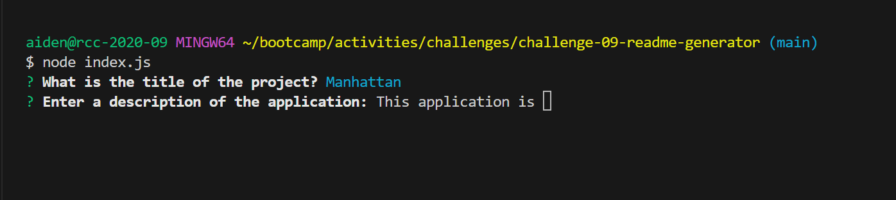
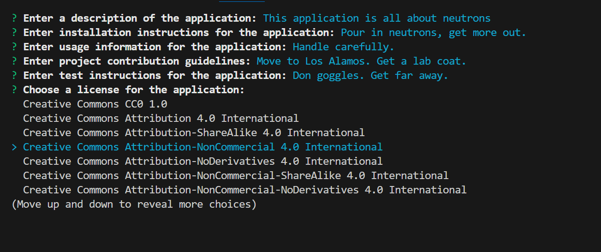
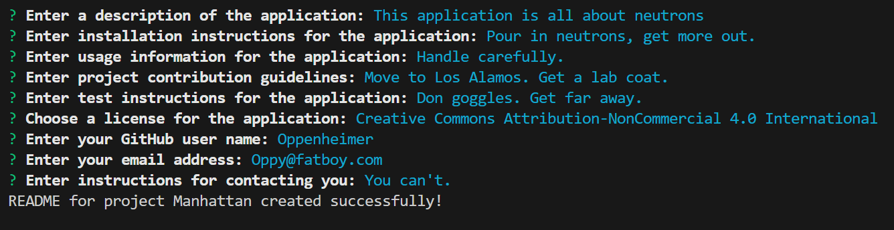
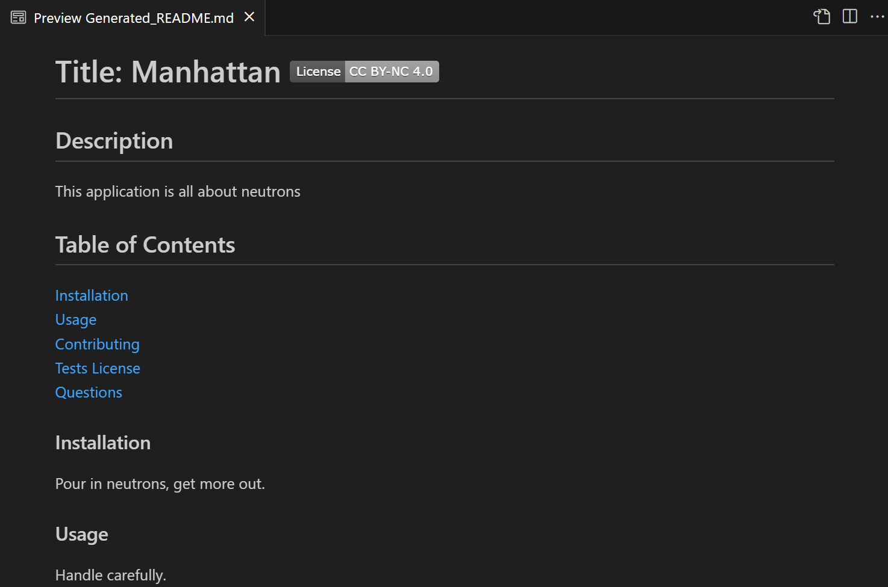
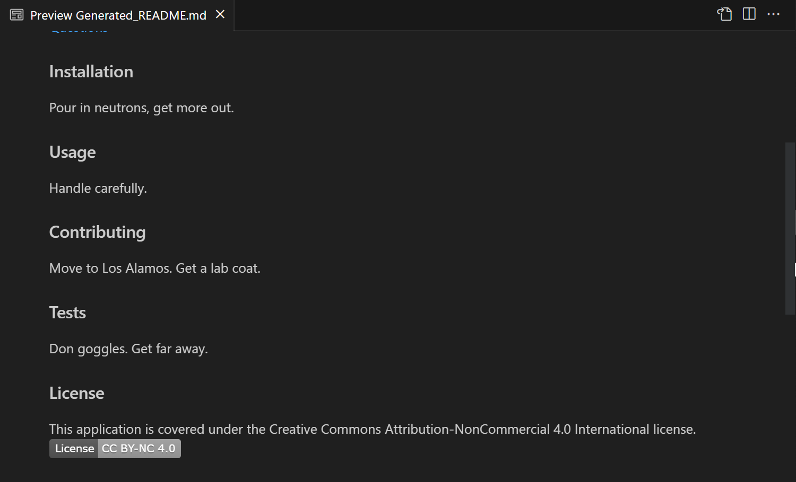
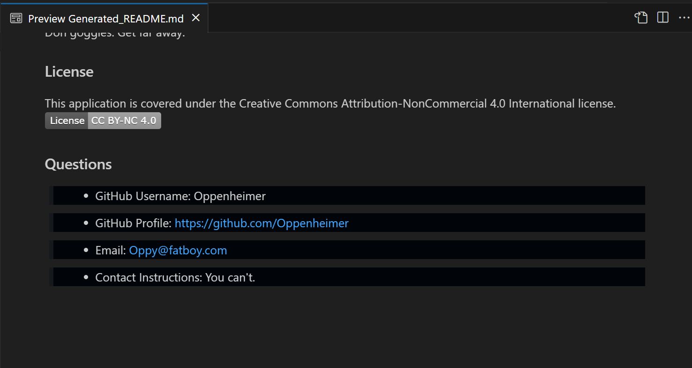

# 09-readme-generator-Project
This is Rick's README generator project.

# Challenge-09 - Node.js Challenge: Professional README Generator

## Description
The purpose of this project is to build a command-line application that dynamically generates a professional README.md file from a user's input. Acceptance Criteria have been broken down into individual features (e.g. AC01). For details on the implementation, review the applicable 'Usage' section of this README.

### User Story

* AS A developer
I WANT a README generator
SO THAT I can quickly create a professional README for a new project

### Acceptance Criteria

> * GIVEN a command-line application that accepts user input
> * AC01: README.md file Generation
>    -	WHEN I am prompted for information about my application repository
>    -	THEN a high-quality, professional README.md is generated with the title of my project and sections entitled Description, Table of Contents, Installation, Usage, License, Contributing, Tests, and Questions

>* AC02: Project Title
>    -	WHEN I enter my project title
>    -	THEN this is displayed as the title of the README

>* AC03: Section Titles and Content
>    -	WHEN I enter a description, installation instructions, usage information, contribution guidelines, and test instructions
>    -	THEN this information is added to the sections of the README entitled Description, Installation, Usage, Contributing, and Tests

>* AC04: License Information 
>    -	WHEN I choose a license for my application from a list of options
>    -	THEN a badge for that license is added near the top of the README and a notice is added to the section of the README entitled License that explains which license the application is covered under

>* AC05: GitHub Username and Profile Link 
>    -	WHEN I enter my GitHub username
>    -	THEN this is added to the section of the README entitled Questions, with a link to my GitHub profile

>* AC06: Contact Information 
>    -	WHEN I enter my email address
>    -	THEN this is added to the section of the README entitled Questions, with instructions on how to reach me with additional questions

>* AC07: Table of Contents 
>    -	WHEN I click on the links in the Table of Contents
>    -	THEN I am taken to the corresponding section of the README

## Installation

> * To watch a video showing the application in use, open the browser and paste the following URL in the address bar, or click on the link: https://watch.screencastify.com/v/HXB8oVZTsVir3jtjNJGG
> * To access the project repo, open the browser and paste the following URL in the address bar, or click on the link: https://github.com/recenasu/challenge-09-readme-generator

## Usage

> * From VSCode, open a terminal window
> * Navigate to the project root directory using bash
> * Type 'node index.js'
> * Press Enter
> * Answer each prompt by typing your answer or selecting an option from the menu, when applicable 
> * After answering the final prompt, wait for the message that the README file has been successfully created (AC01)
> * Open the newly created "Generated_README.md" file in the project root directory
> * Note the project title at the top of the page (AC02)
> * Note the license badge near the project title (AC04)
> * Scroll to view content, or navigate using the Table of Contents links (AC03) (AC04) (AC07) 
> * In the Questions section, note the GitHub username, repo location, email, and contact instructions (AC05) (AC06)

The following images show the application sequence.

> * Initial prompts

> * License selection menu/list

> * README file creation success message

> * README file top

> * README file middle

> * README file bottom

## Credits

npm Inquirer v8.2.6 module was used for the user prompt functionality.

